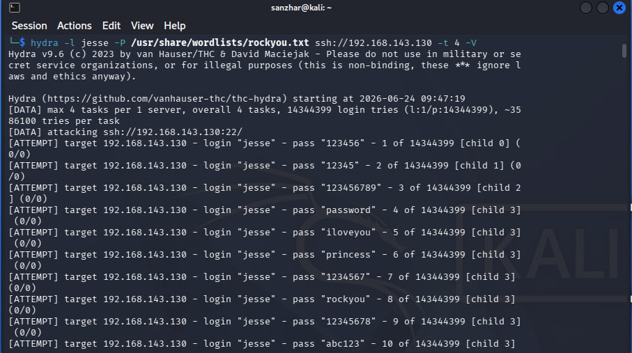

# Home SOC Lab

I set up this lab to understand what 
cyberattacks look like from the inside. 
I spun up three virtual machines, configured a SIEM, and 
simulated real-world attacks.

## Infrastructure

| Machine | OS | Role |
| ---|---|---|
| Ubuntu 22.04 | Docker | Wazuh SIEM |
| Windows 10 | VM | Victim |
| Kali Linux | VM | Attacker |

All three machines are on a single isolated VMware network.
Windows is connected to Wazuh as an agent; all events
from it are sent to the SIEM in real time.

## What I Did

### 1. Brute-force attack via SSH (Hydra)

I ran Hydra from Kali against Windows over SSH.
I used the rockyou.txt dictionary-14 million 
real passwords from data breaches. Hydra tried 
~35,000 combinations per minute.

Wazuh detected thousands of 
“Logon Failure” events in a matter of seconds.

**Key takeaway:** A brute-force attack is detectable by  
an abnormal number of failed logins within 
a short period of time.

### 2. Post-exploitation reconnaissance via PowerShell

After the “hack,” I simulated a hacker’s actions within 
the system. I ran commands that hackers use 
to figure out where they are:

- `whoami` - who am I on the system
- `net user` - what users are present
- `net localgroup administrators` - who is an administrator
- `powershell -enc <base64>` - an encoded command

Sysmon logged every action, and Wazuh generated alerts:

One particularly interesting alert was “Powershell process 
created an exec

One particularly interesting alert is "PowerShell process 
created an executable file in the Windows root folder" 
with a severity level of 9. This was triggered by an obfuscated command.

## Wazuh Dashboard - The Big Picture

During the lab: 26 critical alerts, 
1 medium, 84 low. The critical alerts were mainly from 
the CIS Benchmark-Wazuh checked Windows for 
compliance with the security standard and gave it 
a score of less than 30%.

## Stack

- **Wazuh 4.x** - SIEM, log collection and analysis
- **Sysmon** - detailed logging of Windows processes
- **Hydra** - brute-force attack simulation
- **Nmap** - port scanning and network reconnaissance
- **Docker** - Wazuh deployment
- **VMware** - virtual infrastructure

